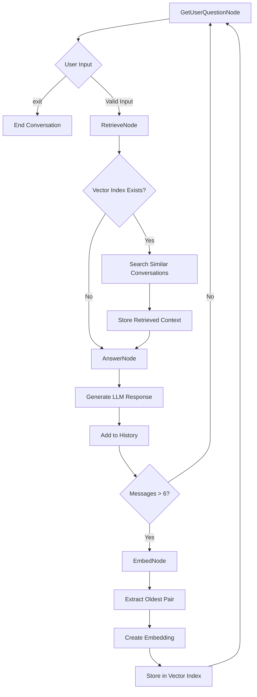

# Interactive Chatbot Flow

## Overview
An interactive chatbot system with conversation memory and semantic retrieval using PocketFlow orchestration.

## Flow Diagram



## Node Details

### GetUserQuestionNode
- **Purpose**: Interactive user input collection
- **Prep**: Initialize messages array on first run
- **Exec**: Get user input via `input()`
- **Post**: Add user message to history
- **Next**: `"retrieve"` → RetrieveNode

### RetrieveNode  
- **Purpose**: Find relevant past conversations
- **Prep**: Extract latest user query and vector index
- **Exec**: Create query embedding and search for similar conversations
- **Post**: Store retrieved conversation in shared state
- **Next**: `"answer"` → AnswerNode

### AnswerNode
- **Purpose**: Generate contextual responses
- **Prep**: Combine retrieved context + recent messages (last 6)
- **Exec**: Call LLM with full context
- **Post**: Print response, add to history
- **Next**: 
  - `"embed"` → EmbedNode (if >6 messages)
  - `"question"` → GetUserQuestionNode

### EmbedNode
- **Purpose**: Archive old conversations
- **Prep**: Extract oldest user-assistant pair
- **Exec**: Create embedding from combined conversation text
- **Post**: Store in vector index, remove from active history
- **Next**: `"question"` → GetUserQuestionNode

## Data Flow

### Shared State
```
shared = {
    "messages": [],              # Recent conversation history (max 6)
    "retrieved_conversation": [], # Context from past conversations
    "vector_index": Index,       # Vector search index
    "vector_items": []           # Stored conversation pairs
}
```

### Memory Management
- **Active Memory**: Last 3 conversation pairs (6 messages)
- **Long-term Memory**: Older conversations stored as embeddings
- **Context Retrieval**: Semantic search finds relevant past conversations

## Key Features

- **Continuous Loop**: Runs until user types 'exit'
- **Memory Archival**: Automatically moves old conversations to vector storage
- **Semantic Retrieval**: Uses embeddings to find contextually relevant past conversations
- **Context Preservation**: Retrieved conversations enhance current responses